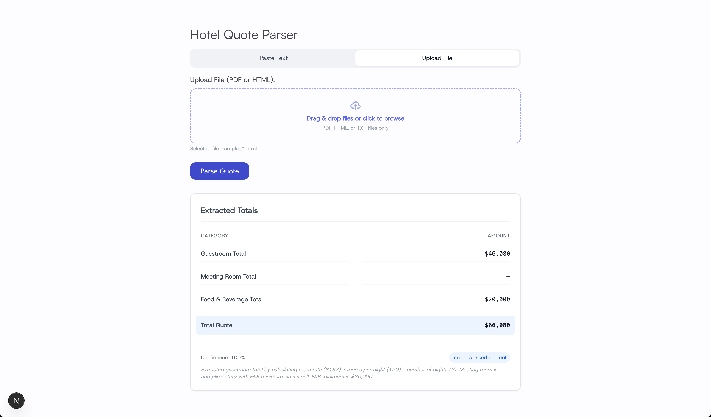
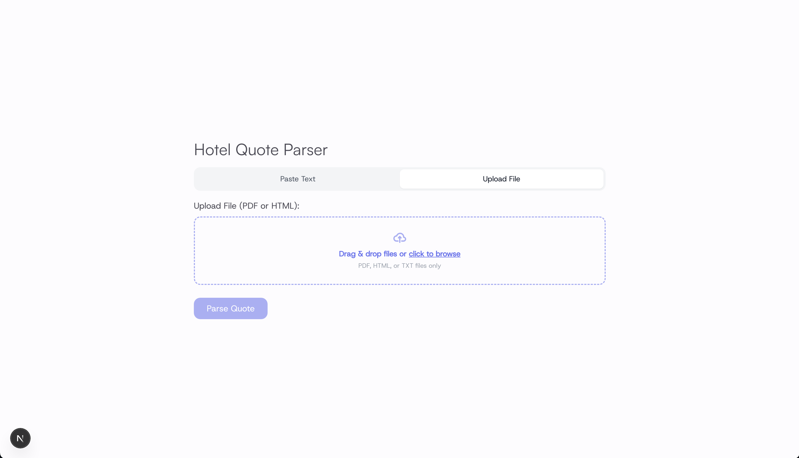
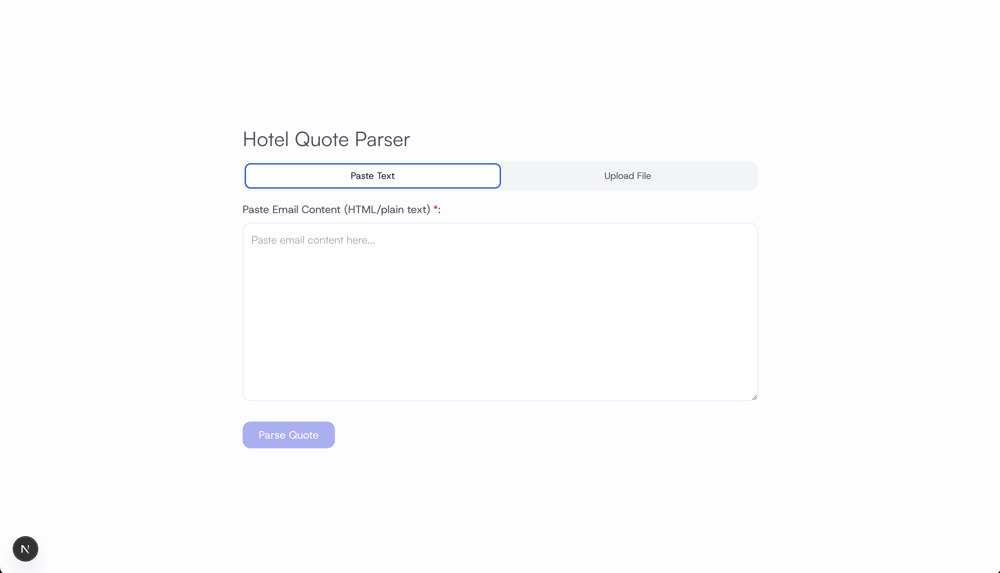

# NLP Financial Data Extractor

This project uses OpenAI's GPT-5 to extract structured financial data from uploaded documents, pasted emails, and linked content. Built with Next.js API Routes, Supabase, and customized prompts to enable automated parsing of financial quote proposals.

## Demo



- **AI-Powered Parsing**: Uses OpenAI GPT-5 with structured prompts to extract financial data as JSON.
- **Multi-format File Support**: Accepts PDFs, HTML, and plain text files up to 10MB.
- **Link Content Scraping**: Fetches and extracts content from embedded URLs in emails or file attachments.
- **Context-Aware Extraction**: Handles "complimentary", "minimum", and "included" conditions with intelligent logic.
- **Supabase Integration**: Stores extracted data, confidence scores, and logs.

## Supported Inputs

- Plain text (pasted)
- Uploaded file (PDF, HTML)
- Linked content (fetched and parsed)

### Extra Showcase

<table width="100%">
  <tr>
    <td align="center" width="50%"></td>
    <td align="center" width="50%"></td>
  </tr>
</table>

This is a [Next.js](https://nextjs.org) project bootstrapped with [`create-next-app`](https://github.com/vercel/next.js/tree/canary/packages/create-next-app).

## Getting Started

First, run the development server:

```bash
npm run dev
# or
yarn dev
# or
pnpm dev
# or
bun dev
```

Open [http://localhost:3000](http://localhost:3000) with your browser to see the result.

You can start editing the page by modifying `app/page.js`. The page auto-updates as you edit the file.

This project uses [`next/font`](https://nextjs.org/docs/app/building-your-application/optimizing/fonts) to automatically optimize and load [Geist](https://vercel.com/font), a new font family for Vercel.

## Learn More

To learn more about Next.js, take a look at the following resources:

- [Next.js Documentation](https://nextjs.org/docs) - learn about Next.js features and API.
- [Learn Next.js](https://nextjs.org/learn) - an interactive Next.js tutorial.

You can check out [the Next.js GitHub repository](https://github.com/vercel/next.js) - your feedback and contributions are welcome!

## Deploy on Vercel

The easiest way to deploy your Next.js app is to use the [Vercel Platform](https://vercel.com/new?utm_medium=default-template&filter=next.js&utm_source=create-next-app&utm_campaign=create-next-app-readme) from the creators of Next.js.

Check out our [Next.js deployment documentation](https://nextjs.org/docs/app/building-your-application/deploying) for more details.
